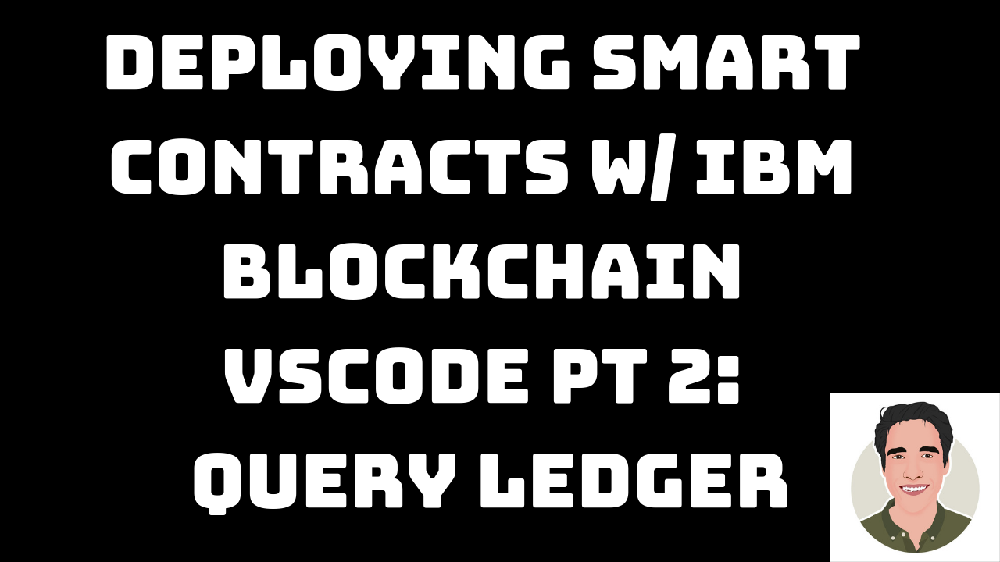

# VSCodeRemoteNetwork

A tutorial to show developers how to quickly connect their smart contract to IBP (IBM Blockchain Platform) Starter Plan using VSCode and the IBP VSCode extension.

# Watch the Videos

